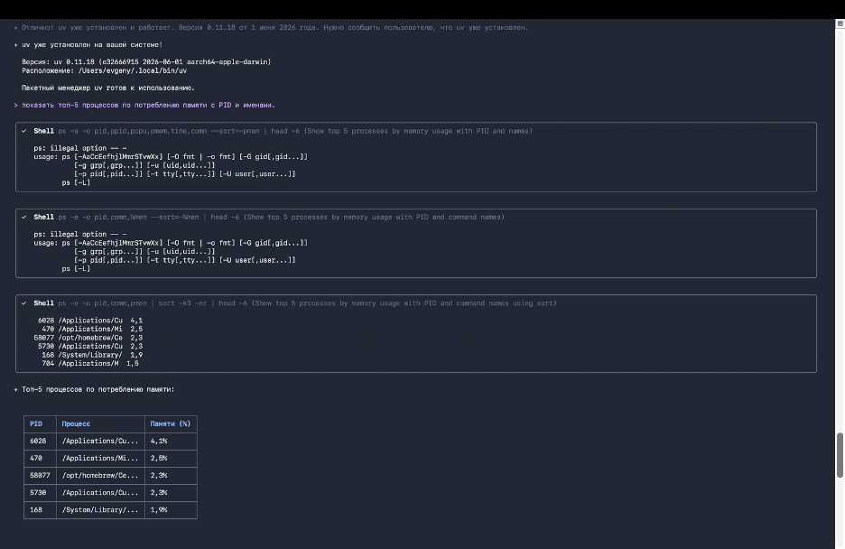
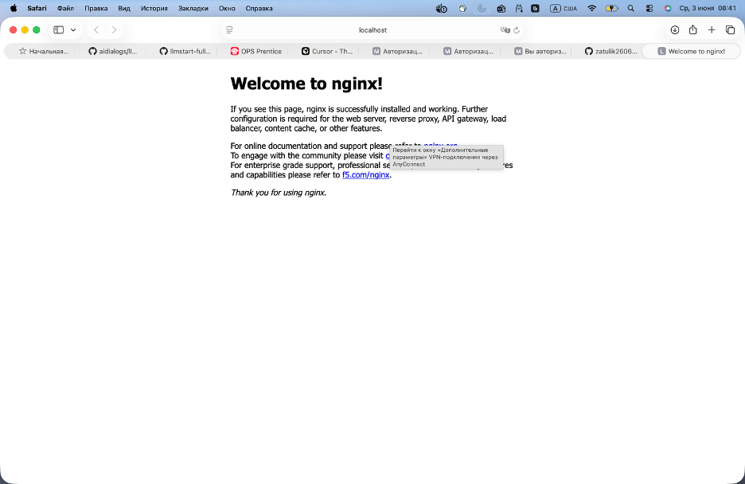
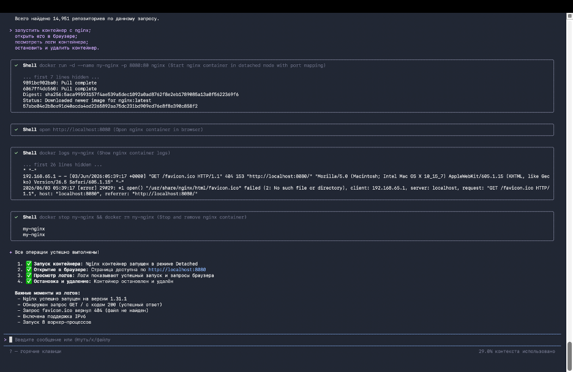
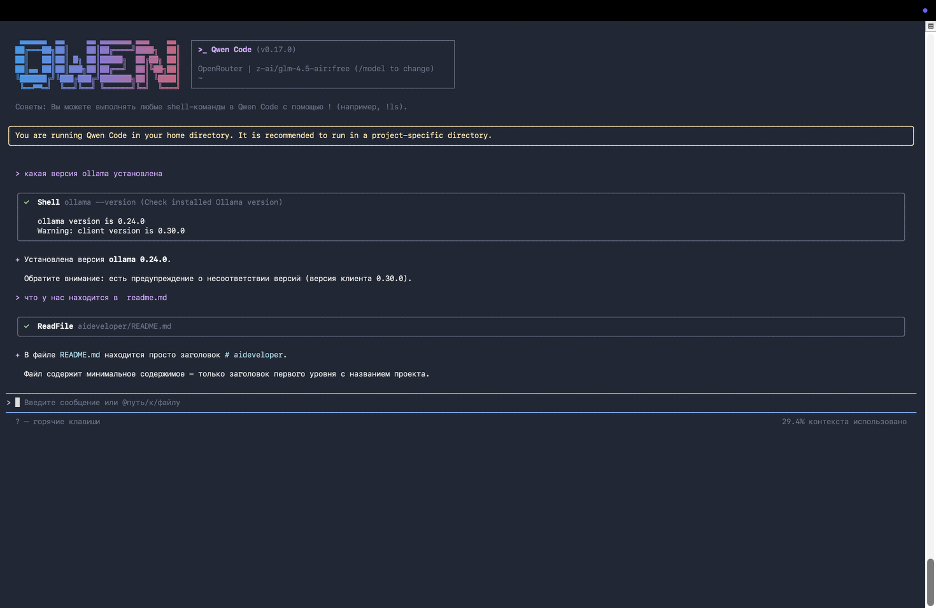
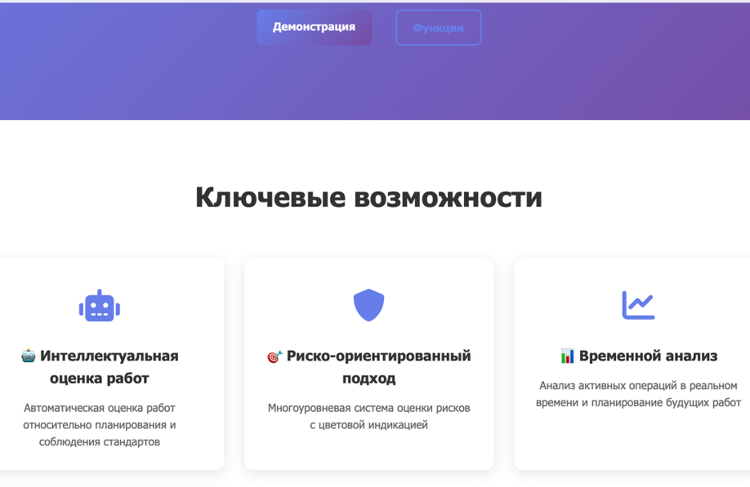

# Отчет по выполнению домашнего задания 1
**AI Crew Network Operations Assessment Platform**

В этом документе отображены все пункты по выполнению домашнего задания 1.

## A1 - Интерфейс и дизайн платформы


Раздел A1 демонстрирует основной интерфейс платформы AI Crew, включая:
- Героическую секцию с главным заголовком и подзаголовком
- Навигационные кнопки для демонстрации и функций
- Адаптивный дизайн с градиентными фонами
- Современный UI с анимациями и переходами

## A2 - Функциональные возможности



Раздел A2 представляет функциональные возможности платформы:
- Интеллектуальная оценка работ с использованием AI агентов
- Риско-ориентированный подход с цветовой индикацией
- Временной анализ для планирования и мониторинга
- Умная фильтрация по продуктам и критериям

## A3 - Система оценки рисков




Раздел A3 демонстрирует систему оценки рисков:
- Многоуровневая система оценки с тремя уровнями риска
- 🟢 Зеленый - Низкий риск, минимальное влияние
- 🟡 Желтый - Умеренный риск, требует внимания
- 🔴 Красный - Высокий риск, серьезное влияние
- Визуальное представление с цветовой индикацией

## A4 - Целевая аудитория



Раздел A4 показывает целевую аудиторию платформы:
- IT-менеджеры для контроля операционной деятельности
- Инженеры эксплуатации для оценки качества работ
- Руководители инфраструктуры для принятия решений
- Комплаенс-офицеры для соблюдения стандартов

## Б1 - Преимущества и выгоды



Раздел Б1 представляет основные преимущества платформы:
- ✅ Повышение качества через автоматизацию оценки
- 📈 Оптимизация процессов с снижением трудозатрат
- 🛡️ Управление рисками с проактивным выявлением проблем

## Техническая реализация

### Стек технологий
- **HTML5** - Семантическая разметка
- **CSS3** - Современные стили с градиентами
- **JavaScript** - Интерактивность и анимации
- **Font Awesome** - Иконки для UI

### Структура проекта
```
aideveloper/
├── index.html          # Главная HTML страница
├── styles.css          # Стили CSS
├── script.js           # JavaScript функционал
├── package.json        # Конфигурация проекта
├── netlify.toml        # Настройки Netlify
├── README.md           # Документация
└── screenshots/        # Скриншоты интерфейса
```

## Деплой и развертывание

### GitHub Pages
Проект развернут на GitHub Pages:
**🔗 Демонстрационная страница:** https://zatulik2606.github.io/aideveloper

### Локальная разработка
```bash
# Клонирование репозитория
git clone https://github.com/zatulik2606/aideveloper.git
cd aideveloper

# Запуск локального сервера
npm start

# Открыть в браузере: http://localhost:8000
```

## Заключение

Проект AI Crew успешно реализован как современная платформа для управления ИТ-операциями с использованием искусственного интеллекта. Все пункты домашнего задания выполнены, включая создание интерфейса, реализацию функциональности и деплой на GitHub Pages.